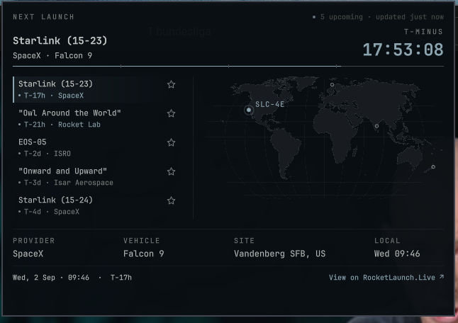

# Rocket Launches

An Omarchy bar plugin that shows the next upcoming rocket launch on a
stylized world map, right in the shell.



## Status

Feature-complete and in daily use. The bar pill shows a live countdown to
the tracked launch (accent-tinted in the final hour before T-0); the popup
lists the next 5 upcoming launches with a pin/watch toggle, a hero countdown
header, and a world map (curved Natural Earth projection, no map tiles —
launch sites plotted from local coordinates) that zooms in on hover. See
`docs/DECISIONS.md` for the design decisions behind the original MVP and
`docs/RESEARCH.md` for the API/plugin-platform research it's based on.

## Data source

Launch data comes from the free [RocketLaunch.Live](https://fdo.rocketlaunch.live/)
`launches/next/5` endpoint — no API key required. Data by RocketLaunch.Live.

The API doesn't include launch site coordinates, so the map plots sites from
a small local lookup table (`LaunchSites.js`). Only a handful of entries
have been confirmed against a real API response; the rest are best-effort
guesses at the site-name-to-slug convention. A launch at an unlisted or
mismatched site still shows up in the list and detail view — it just won't
appear on the map. Pull requests adding confirmed slugs are welcome.

## Install

Review the repository, then add the plugin:

```bash
omarchy plugin add <actual-plugin-git-url>
```

Accept the prompt to enable the plugin during installation.

For an unattended install from a repository you already trust:

```bash
omarchy plugin add <actual-plugin-git-url> --enable --yes
```

## Update

```bash
omarchy plugin update ksxx.liftoff
```

## Validate from source

```bash
omarchy plugin validate .
```

## Security

This plugin runs unsandboxed inside `omarchy-shell` when enabled.

- Network access: periodic `curl` requests to `https://fdo.rocketlaunch.live/`
  to fetch upcoming launch data (no API key, no request body, no
  authentication).
- No files are read or written outside the plugin's own settings stored in
  `~/.config/omarchy/shell.json` by the shell itself.
- No background services outside the widget's own poll timer.
- No user configuration is required outside the plugin's bar-widget
  settings.
